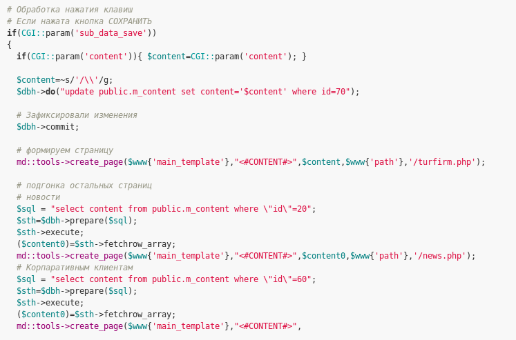
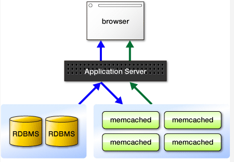

class: firstpage title

# Программирование на Perl

## Работа с базами данных

---

class:note_and_mark title

# Отметьтесь на портале!

---

# SQL

```sql
SELECT name, surname
FROM users
WHERE age > 18
```

```sql
SELECT balance
FROM account
WHERE user_id = 12574
```

```sql
SELECT *
FROM users u JOIN accounts a
    ON u.id = a.user_id
WHERE account.balance > 0
```

---

class:center
# Схема

.img-xkcd[

]

---

# DBI

```perl
$dbh = DBI->connect(
  $dsn, $user, $password,
  {RaiseError => 1, AutoCommit => 0}
);

$dbh->do($sql);
```

---

# connect

```perl
$dbh = DBI->connect($data_source,
    user, $password, {...});

# DBD::SQLite
$dbh = DBI->connect("dbi:SQLite:dbname=dbfile",
    "","");

# DBD::mysql
$dbh = DBI->connect(
    "DBI:mysql:database=$database;" . 
        "host=$hostname;port=$port",
    $user, $password
);
```

```
dbi:DriverName:database_name
dbi:DriverName:database_name@hostname:port
dbi:DriverName:database=DBNAME;host=HOSTNAME;port=PORT
```

---

# do

```perl
my $number_of_rows = $dbh->do(
    'DELETE FROM user WHERE age < 18
');

my $name = <>;
$dbh->do(
     "DELETE FROM user WHERE name = '$name'"
);
```

---

# SQL injections

```perl
my $name = q{' OR (DELETE FROM log) AND '' = '};

$dbh->do("DELETE FROM user WHERE name = '$name'");
```

```sql
DELETE FROM user WHERE name = ''
    OR (DELETE FROM log) AND '' = ''
```

```perl
$name = $dbh->quote($name);
```

---

class:center
# SQL injections

.img-xkcd[

]

---


# prepare, execute

```perl
my $sth = $dbh->prepare(
    'DELETE FROM user WHERE name = ?'
);

$sth->execute('Vadim');
```

---

# fetchrow

```perl
my $ary_ref = $sth->fetchrow_arrayref();
my @ary     = $sth->fetchrow_array();
my $hash    = $sth->fetchrow_hashref();

while (@row = $sth->fetchrow_array()) {
     print "@row\n";
}
```

---

# fetchrow_*

```perl
my $sth = $dbh->prepare(
    "SELECT * FROM student where id = ?"
);
$sth->execute(1);

my $array_ref = $sth->fetchrow_arrayref();

# ['1', 'Маша', 'ВМК', '401b']

```

---

# fetchrow_array

```perl
my $sth = $dbh->prepare(
    "SELECT * FROM student where id = ?"
);
$sth->execute(1);

my @array = $sth->fetchrow_arrayref();

# ('1', 'Маша', 'ВМК', '401b')
```

---

# fetchrow_hashref

```perl
my $sth = $dbh->prepare(
    "SELECT * FROM student where id = ?"
);
$sth->execute(1);

my $hash_ref = $sth->fetchrow_hashref();

# {
#      'class' => '401b',
#      'name' => 'Маша',
#      'id' => '1',
#      'faculty' => 'ВМК'
# };
        
```


---

# fetchall_arrayref

```perl
my $ary = $sth->fetchall_arrayref;
# [ [...], [...], [...] ]

my $ary = $sth->fetchall_arrayref({});
# [ {...}, {...}, {...} ]

$tbl_ary_ref = $sth->fetchall_arrayref(
    [0]
);

$tbl_ary_ref = $sth->fetchall_arrayref(
    [-2,-1]
);

$tbl_ary_ref = $sth->fetchall_arrayref({
    foo => 1,
    BAR => 1,
});
```

---
# fetchall_arrayref

```perl
my $sth = $dbh->prepare(
    "SELECT * FROM student"
);
$sth->execute();

my $array_ref = $sth->fetchall_arrayref({});

# [
#   {
#     'class' => '401b',
#     'id' => '1',
#     'faculty' => 'ВМК',
#     'name' => 'Маша'
#   },
#   {
#     'faculty' => 'ВМК',
#     'id' => '2',
#     'class' => '401b',
#     'name' => 'Николай'
#   },
#   ...
# ]
```

---

# fetchall_hashref

```perl
$sth->fetchall_hashref('id');
# { 1 => {...}, 2 => {...} }

$sth->fetchall_hashref([ qw(surname name) ]);

# { 
#    'Иванов' => { 'Игорь' => {...}, 'Вадим' => {...} },
#    'Петров' => { 'Павел' => {...}, 'Сергей' => {...} },
# }
```

---

# selectrow

```perl
$dbh->selectrow_array(
    $statement, \%attr, @bind_values
);

$dbh->selectrow_arrayref(
    $statement, \%attr, @bind_values
);

$dbh->selectrow_hashref(
    $statement, \%attr, @bind_values
);
```

---

# selectall

```perl
$dbh->selectall_arrayref(
    $statement, \%attr, @bind_values);

$dbh->selectall_hashref(
    $statement, $key_field, \%attr, @bind_values);

$dbh->selectall_arrayref(
    "SELECT ename FROM emp ORDER BY ename",
    { Slice => {} }
);
```

---

# selectall_arrayref

```perl

my $array_ref = $dbh->selectall_arrayref(
    "SELECT * FROM teacher ORDER BY first_name",
    { Slice => {} }
);

# [
#   {
#     'last_name' => 'Казаков',
#     'id' => '1',
#     'first_name' => 'Александр',
#     'floor' => '4'
#   },
#   {
#     'first_name' => 'Андрей',
#     'id' => '2',
#     'last_name' => 'Аносов',
#     'floor' => '3'
#   },
#   {
#     'id' => '3',
#     'first_name' => 'Игорь',
#     'last_name' => 'Карбачинский',
#     'floor' => '4'
#   }
# ]


```

---

# Errors

```perl
$dbh = DBI->connect(
  "dbi:DriverName:db_name", $user, $password,
  { RaiseError => 1 }
);
```

```perl
$dbh->err;
$dbh->errstr;
```

---

# Transactions

```perl
$dbh = DBI->connect(
  "dbi:DriverName:db_name", $user, $password,
  { AutoCommit => 1 }
);

$dbh->begin_work;
$dbh->rollback;
$dbh->commit;
```

---

# last_insert_id

```perl
$dbh->do('INSERT INTO user VALUES(...)');

my $user_id = $dbh->last_insert_id(
    $catalog, $schema, $table, $field, \%attr
);
```

---

class:center
# ok?

.img-xkcd[

]

---

class:center
# ORM

.img-xkcd[

]

---

# DBIx::Class

```perl
package Local::Schema::User;
use base qw(DBIx::Class::Core);

__PACKAGE__->table('user');
__PACKAGE__->add_columns(
    id => {
        data_type => 'integer',
        is_auto_increment => 1,
    },
    name => {
        data_type => 'varchar',
        size      => '100',
    },
    superuser => {
        data_type => 'bool',
    },
);
```


---

# DBIx::Class

```perl
__PACKAGE__->set_primary_key('id');
__PACKAGE__->has_many(
    visits => 'Local::Schema::Visit',
    'user_id'
);
__PACKAGE__->many_to_many(
    visited_cities => 'visits',
    'city'
);
```

---

# resultset, result

```perl
my $resultset = $schema->resultset('User');
my $resultset2 = $resultset->search({age => 25});

while (my $user = $resultset->next) {
    print $user->name . "\n";
}

print join "\n", $resultset2->all();
```

---

# search

```perl
$rs = $rs->search({
  age => {'>=' => 18},
  parent_id => undef,
});
```

```perl
@results = $rs->all();
@results = $rs->search(...);
$rs = $rs->search(...);
$rs = $rs->search_rs(...);
```

---

# search — attributes

```perl
$rs = $rs->search(
  { page => {'>=' => 18} },
  { order_by => { -desc => [qw(a b c)] } },
);

$rs = $rs->search(undef, {rows => 100});
```

---

# find, single

```perl
my $rs = $schema->resultset('User');

$user = $rs->find({id => 81858});
$user = $rs->find(81858);

$user = $rs->search({id => 81858})->single();
```

---

# count

```perl
my $count = $schema->resultset('User')->search({
  name => 'name',
  age => 18,
})->count();
```

---

# Relations

```perl
package Local::Schema::User;
use base qw(DBIx::Class::Core);

__PACKAGE__->table('user');
__PACKAGE__->has_many(
    dogs => 'Local::Schema::Dog',
    'user_id'
);

package Local::Schema::Dog;
use base qw(DBIx::Class::Core);

__PACKAGE__->table('dog');
__PACKAGE__->belongs_to(
    user => 'Local::Schema::User',
    'user_id'
);
```

---

# Relations — usage

```perl
$user = $schema->resultset('User')->find(81858);

foreach my $dog ($user->dogs) {
  print join(' ', $dog->id, $dog->user->id);
}
```

---

# join

```perl
$rs = $schema->resultset('Dog')->search({
  'me.name' => 'Sharik',
  'user.name' => 'Vadim',
}, {
  join => 'user',
});
```

---

# Custom resultset methods

```perl
my @women = $schema->resultset('User')->
    search_women()->all();
```

```perl
package Local::Schema::ResultSet::User;

sub search_women {
  my ($self) = @_;

  return $self->search({
    gender => 'f',
  });
}
```

---

# Custom result methods

```perl
foreach my $woman (@women) {
  $woman->log('was selected');
}
```

```perl
package Local::Schema::Result::User;

sub log {
  print {$log} @_;
}
```

---

# new_result, create

```perl
my $user = $schema->resultset('User')->new_result({
  name => 'Vadim',
  superuser => 1,
});

$user->insert();
```

```perl
my $artist = $artist_rs->create(
   { artistid => 4, name => 'Blah-blah', cds => [
      { title => 'My First CD', year => 2006 },
      { title => 'e.t.c', year => 2007 },
    ],
   },
);
```

---

# update, delete

```perl
$result->last_modified(\'NOW()')->update();
# OR
$result->update({ last_modified => \'NOW()' });
```

```perl
$user->delete();
```

---

# DBIx::Class::Schema::Loader

```perl
use DBIx::Class::Schema::Loader qw(
    make_schema_at
);

make_schema_at(
    'My::Schema',
    { debug => 1,
      dump_directory => './lib',
    },
    [ 'dbi:Pg:dbname="foo"', 'user', 'pw' ]
);
```

```sh
dbicdump -o dump_directory=./lib \
         -o debug=1 \
         My::Schema \
         'dbi:Pg:dbname=foo' \
         myuser \
         mypassword
```

---

class:center
# Memcached

.img-xkcd[

]

---

# Memcached

```perl
use Cache::Memcached::Fast;

my $memd = Cache::Memcached::Fast->new({
  servers => [
    {address => 'localhost:11211', weight => 2.5},
    '192.168.254.2:11211',
    '/path/to/unix.sock'
  ],
  namespace => 'my:',
  connect_timeout => 0.2,
  # ...
});
```


---

# Memached — operations

```perl
$memd->add('skey', 'text');
$memd->set('nkey', 5, 60);
$memd->incr('nkey');
$memd->get('skey');
```

---

# NoSQL

* Redis
* MongoDB
* Cassandra
* ElasticSearch
* Aerospike
* Tarantool

---

# ДЗ

https://github.com/Nikolo/Technosfera-perl/

`/homeworks/social_network`

---

class:lastpage title

# Спасибо за внимание!

## Оставьте отзыв

.teacher[]


