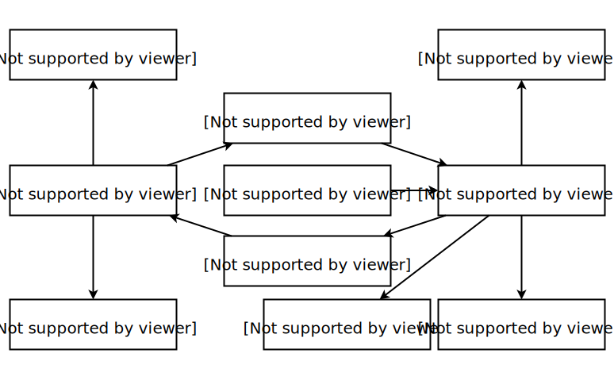
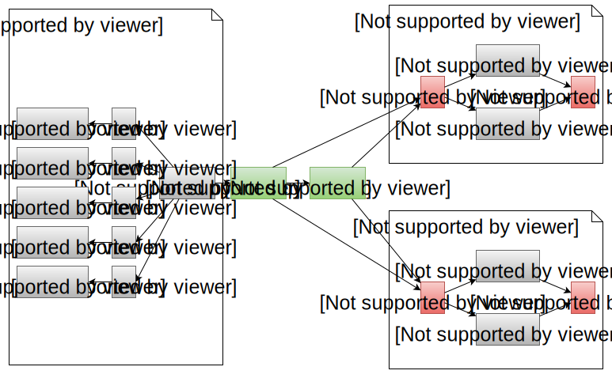

class:firstpage, title

# Программирование на Perl

## Основы синтаксиса

---
class:note_and_mark title

# Отметьтесь на портале!

---
layout:false
# Содержание

* Структуры данных
    - Массивы
    - Хэши
* Функции для работы со списками
* Управление циклами
* Постфиксная запись
* Интерполяция в строках
* Функции
    - Декларация
    - Аргументы
    - Использование

---
layout:true
# Переменные

---

* SCALAR
    - Number
    - String
    - Reference
* ARRAY
    - Of scalars
* HASH
    - Key: string
    - Value: scalar

---

* SCALAR (`$s`)
    - Number
    - String
    - Reference
* ARRAY (`@a`)
    - Of scalars
* HASH (`%h`)
    - Key: string
    - Value: scalar

---

* SCALAR (`$s`)
    - Number
        + Integer value (`$s = 1`)
        + Numeric value (double) (`$s = 3.14`)
    - String (`$s = "str"`)
    - Reference (`$r`)
        + Scalar (`$$r`)
        + Array (`@$r`)
        + Hash (`%$r`)
        + Function (`&$r`)
        + Filehandle (`*$r`)
        + Lvalue (`$$r`)
        + Reference (`$$r`)
* ARRAY (`@a`)
* HASH (`%h`)

---
layout:true
# SCALARs

---

## Числа
```perl
my $int         = 12345;
my $pi          = 3.141592;
my $pi_readable = 3.14_15_92_65_35_89;
my $plank       = .6626E-33;
my $hex         = 0xFEFF;
my $bom         = 0xef_bb_bf;
my $octal       = 0751;
my $binary      = 0b10010011;
```

---

## Строки
```perl
my $one    = "string";
my $two    = 'quoted';
my $wrap   = "wrapped
           string";
my $join   = "prefix:$one\r\n";

my $q_1    = q/single-'quoted'/;
my $qq_2   = qq(double-"quoted"-$two);
my $smile  = ":) -> \x{263A}";

my $here   = <<END;
some data
END

my $ver    = v1.2.3.599;
```

---

## Ссылки
```perl
my $scalar_ref = \$scalar;       # SCALAR
my $array_ref  = \@array;        # ARRAY
my $hash_ref   = \%hash;         # HASH
my $code_ref   = \&function;     # CODE
my $glob_ref   = \*FH;           # GLOB
my $ref_ref    = \$scalar_ref;   # REF

my $array_ref  = [ 4,8,15,16 ];
my $hash_ref   = { one => 1, two => 2 };
my $code_ref   = sub { ... };

my ($one,$two) = (\"one",\"two");
my ($one,$two) = \("one","two");
```


---
layout:false

# ARRAYs: создание

```perl
my @av1 = (4,8,15,16,23,42);
my @av2 = ('q','w','e');
my @av2 = (1,2,3,'q','w','e');
my @digits = 0..9;

my @simple = qw(a b c); # ('a','b','c')

my @array = (1,2,3,@simple,4,5);
my @array = (1,2,3,'a','b','c',4,5);

my $aref = \@array; # take ref
my $aref = [1,2,3,@simple,4,5]; # anon ref

my $aref = [@array]; # copy + anon ref
my $aref = [ (@array) ]; # av->list, list->aref
```

.footer[[Array vs list](http://friedo.com/blog/2013/07/arrays-vs-lists-in-perl)]

---

# ARRAYs: обращение

```perl
`$`ARRAY[ `SCALAR` ]: `SCALAR`
```

```perl
my @array = (1,2,3,'a','b','c',4,5);
my $aref = \@array;

say `$`array[3];    # a
say ${array}[3];  # a
say ${array[3]};  # a

say "last elt = ", `$#`array; # 7
say "length   = ", scalar `@`array; # 8

say $aref->[3]; 
say ${$aref}[3];
say "last elt = ", `$#`$aref;
say "last elt = ", `$#{`$aref`}`;
say "length   = ", scalar `@{`$aref`}`;
```

---

# ARRAYs: обращение

```perl
`$`ARRAY[ `SCALAR` ] = `SCALAR`
```

```perl
my @array = ();
my @array;      # better

$array[0] = 1;
$array[1] = 2;
$array[7] = 5;

say $#array; # 7
say $array[`-1`]; # 5

use Data::Dumper;
say Dumper \@array;
# [1,2,undef,undef,undef,undef,undef,5]
use DDP;
p @array;
```

---

# ARRAYs: срезы

```perl
`@`ARRAY[ `LIST` ]: `LIST`
```

```perl
my @array = (4,8,15,16,23,42);
$aref = \@array;

say join ",", `@`array[0,2,4]; # 4,15,23
say join ",", `@{`array`}`[0,2,4]; # 4,15,23
say join ",", `@`array[0..2]; # 4,8,15

say join ",", @$aref[0,2,4]; # 4,15,23
say join ",", @{ $aref }[0,2,4]; # 4,15,23

@array[5..7] = (10,20,30);
say join ",", @array; # 4,8,15,16,23,10,20,30
```

---
class:center

# ARRAY



---

# ARRAY ops: push, pop, shift, unshift

.left[
```perl
my @a;
push @a, 1;
push @a, 2,3,4;
my $x = pop @a;
my $x = shift @a;
unshift @a, 7,8;
```
]
.right[
```perl
# @a = ()
# @a = (1)
# @a = (1,2,3,4)
# @a = (1,2,3), $x = 4
# @a = (2,3), $x = 1
# @a = (7,8,2,3)
```
]

```perl
my @a =      ( 1, 2, 3, 4, 5, 6, 7 );
#   │             └────┬┘
#   │             └─┐  │     ┌ replacement
#   └───────────┐   │  │  ┌──┴───┐
my @b = splice( @a, 1, 3, ( 8, 9 ) );
say @a; # 1, 8, 9, 5, 6, 7
say @b; # 2, 3, 4
```

---

# ARRAY ops: for

```perl
my @a = (4,8,15,16,23,42);
```

## Не делайте так:
.not[
```perl
*for (my $i; $i <= $#a; $i++) { ... }
*for (my $i; $i < @a; $i++) { ... }
```
]

> Почему? C-style. Если нужен индекс:

```perl
for my $i (0..$#a) { ... }
```

> Если нужны только значения:

```perl
for my $var (@a) { ... }
```

---

# ARRAY ops: for

```perl
my @array = (4,8,15,16,23,42);
```
.left[
```perl
`for` (@array) {
    say $_;
}
```
]
.right[
```perl
`foreach` (@array) {
    say $_;
}
```
]
.center[
## for ≡ foreach
]
.left[
```perl
for `my $val` (@array) {
    say $val;

    `$val`++;
}
say "@array";
```
]
.right[
```perl
4
8
15
16
23
42
`5 9 16 17 24 43`
```
]

---

# ARRAY ops: while each

```perl
my @array = (4,8,15,16,23,42);

while (my ($i,$v) = `each` @array) {
    say "$i: $v";                    # 0: 4
    $v++;                            # 1: 8
}                                    # 2: 15
                                     # 3: 16
say "@array";                        # 4: 23
# 4 8 15 16 23 42                    # 5: 42
```

---

# HASHes: создание

```perl
my %first = (
    key1 => "value1",
    key2 => "value2",
);
my %second = (
    'key3', "value3",
    'key4', "value4",
);
my %third = qw(key5 value5 key6 value6);
my %all = (%first, %second, %third);

my $href = \%hash;
my $href = {
    key1 => "value1",
    key2 => "value2",
};
```

---

# HASHes: создание

```perl
my `%`hash = `(`
    key1 => "value1",
    key2 => "value2",
`)`;

my `$`href = `{`
    key1 => "value1",
    key2 => "value2",
`}`;
```

---

# HASHes: создание

```perl
my @array = qw(key1 val1 key2 val2);

my %hash = @array;

use Data::Dumper;
say Dumper \%hash;

# {
#    key1 => "val1",
#    key2 => "val2",
# }

my $aref = [qw(key1 val1 key2 val2)];
my %hash = `@{`$aref`}`;

my $hashref = { @array };
my $hashref = { `@{`$aref`}` };
```

---

# HASHes: использование

```perl
`$`HASH{ `SCALAR` }: `SCALAR`
`$`HASH{ `BAREWORD` }: `SCALAR`
```

```perl
my %hash = (key1 => "value1", key2 => "value2");
my $href = {key1 => "value1", key2 => "value2"};
my $key = "key2";

say $hash{"key2"}; # value2
say $hash{ key2 }; # value2
say $hash{ $key }; # value2

say $href->{"key2"};
say $href->{ key2 };
say $href->{ $key };
say `${`$href`}`{ key2 };

```

---

# HASHes: использование

```perl
`$`HASH{ `SCALAR` } = `SCALAR`
`$`HASH{ `BAREWORD` } = `SCALAR`
```

```perl
my %hash;
my $href = {};
$hash{ key1 } = "value1";
$hash{ key2 } = "value2";
$href->{ key1 } = "value1";
$href->{ key2 } = "value2";
`${`$href`}`{ key3 } = "value3";

say Dumper \%hash;
# {
#    key1 => "val1",
#    key2 => "val2",
# }
```

---

# HASHes: использование

```perl
my %simple = qw(k1 1 k2 2);
my %hash = (key3 => 3, key4 => "four", %simple);
my $key = "key3";

say join ",", %simple; # k2,2,k1,1
say join ",", %simple; # k1,1,k2,2

say join ",", `keys`   %hash; # k2,key3,k1,key4
say join ",", `values` %hash; # 2, 3,   1, four

say join ",", `@`hash`{` "k1", $key `}`; # 1,3

my $one = `delete` $hash{k1}; say $one; # 1
say $hash{k2} if `exists` $hash{k2}; # 2
```

---


---

# HASH ops: while/each

```perl
my %hash = (key1 => "value1", key2 => "value2");

while (my ($k,$v) = each %hash) {
    say "$k: $v";
}
```

.f-right[
# ⚠
]

> Итератор прикреплён к переменной.<br>Обращение к `keys`, `values` сбивает итератор

.clear[]

.not[
```perl
while (my ($k,$v) = each %hash) {
*   my @keys = `keys` %hash;
    say "$k in (@keys)";
}
```
]

> Данная программа будет выполняться в бесконечном цикле

---

# HASH ops: for, keys, values

```perl
my %hash = ( key1 => "value1",
    key2 => "value2", key3 => "value3");

for my $key (keys %hash) {
    say $key;          # key2   key1   key3
    say $hash{$key};   # value2 value1 value3
}
for `my $value` (values %hash) {
    say $value;        # value2 value1 value3
    $value .= "+1";
}

p %hash;
#    key1   "value1`+1`"
#    key2   "value2`+1`"
#    key3   "value3`+1`"

```

---

# HASH ops: reverse

```perl
my %hash = ( key1 => "value1", key2 => "value2");

p %hash;
#    key1   "value1"
#    key2   "value2"

my %rev = reverse %hash;

p %rev;
#    value1   "key1",
#    value2   "key2"
```

---

# Переменные: ARRAY & HASH



---
# Содержание

* Структуры данных
    - Массивы
    - Хэши
* **Функции для работы со списками**
* Управление циклами
* Постфиксная запись
* Интерполяция в строках
* Функции
    - Декларация
    - Аргументы
    - Использование

---

# grep

```perl
OUT_LIST = grep { ... } IN_LIST
OUT_LIST = grep `...`, IN_LIST
# ... must return true or false
```

--

```perl
for (IN_LIST) {
    push @OUT_LIST, $_ if ...;
}
return @OUT_LIST
```

--
```perl
my @strings = ('qwe','sdf','','zxc');
my @nonempty = grep { length $_ } @strings;
# qwe sdf zxc
my $count = grep { length $_ } @strings;
# 3
my @odd  = grep {     $_ % 2 } 1..100;
my @even = grep { not $_ % 2 } 1..100;
```

.footer[[grep](http://perldoc.perl.org/functions/grep.html)]

---

# map

```perl
OUT_LIST = map { ... } IN_LIST
OUT_LIST = map `...`, IN_LIST
# ... must return output
```

--

```perl
for (IN_LIST) {
    push @OUT_LIST, ...;
}
return @OUT_LIST
```

--

```perl
my @squares = map { $_**2 } 1..5; # 1,4,9,16,25
say map chr($_), 65..70;          # ABCDEF

my %hash = map { $_ => $_**2 } 1..5;
# { 1 => 1, 2 => 4, 3 => 9, 4 => 16, 5 => 25 }
```

.footer[[map](http://perldoc.perl.org/functions/map.html)]

---

# sort

```perl
OUT_LIST = sort IN_LIST # string sort
OUT_LIST = sort { ... } IN_LIST
`$a`, `$b` # sort vars
`<=>`, `cmp` # comparators
```

--

```perl
@alphabetically = sort @strings;
@nums = sort { $a <=> $b } @numbers;
@rev = sort { $b <=> $a } @numbers;
@ignorecase = sort { fc($a) cmp fc($b) } @strings;

for my $k (sort keys %hash) {
    say "$k: $hash{$k}";
}
```

.footer[[sort](http://perldoc.perl.org/functions/sort.html)]

---

# sort: `cmp` vs `<=>`


```perl
say "x" cmp "y"; # -1, x less than y
say "x" cmp "x"; #  0, x equals to x
say "y" cmp "x"; #  1, y greater than x

say 2 <=> 7; # -1, 2 less than 7
say 5 <=> 5; #  0, 5 equals to 5
say 7 <=> 2; #  1, 7 greater than 2

say "x" <=> "y";  # 0, x equals to y `numerically`
say "2" cmp "10"; # 1, 2 gt than 10 as `strings`

sub smart {
    $a <=> $b # compare as numbers. strings give 0
    ||        # 0 passes to second comparison
    fc($a) cmp fc($b) # compare as strings, CI
}
my @sorted = sort smart @strings;
```


---
class:center, middle

# \_\_END\_\_

---

# grep

```perl
my @with_dups = qw(a b c a e n f a d e s x a);
{
    %uniq = ();
    @unique = grep { !$uniq{$_}++ } @with_dups;}    
}

@a = 1..55;
@b = 45..100;
%chk; @chk{@a} = ();
@merge = grep { exists $chk{$_} } @b;
```


